### Step 1: Create a project under google developer console.

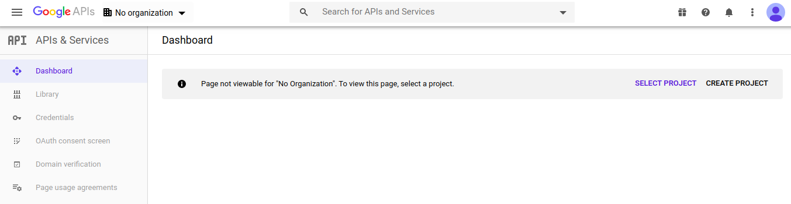

### Step 2: Select a organization by clicking on No organization on top bar

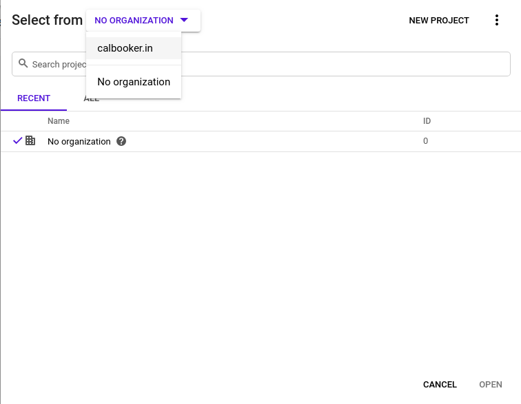
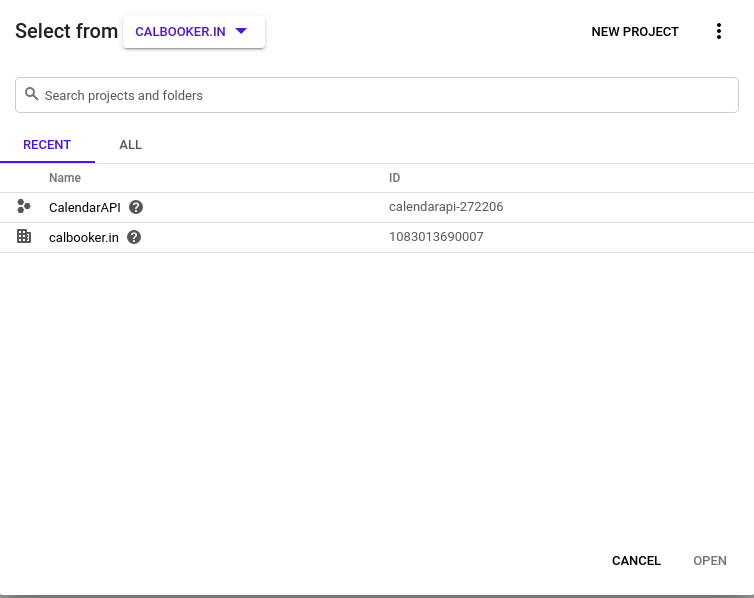

### Step 3: Create a new project by clicking on NEW PROJECT and put all the details required

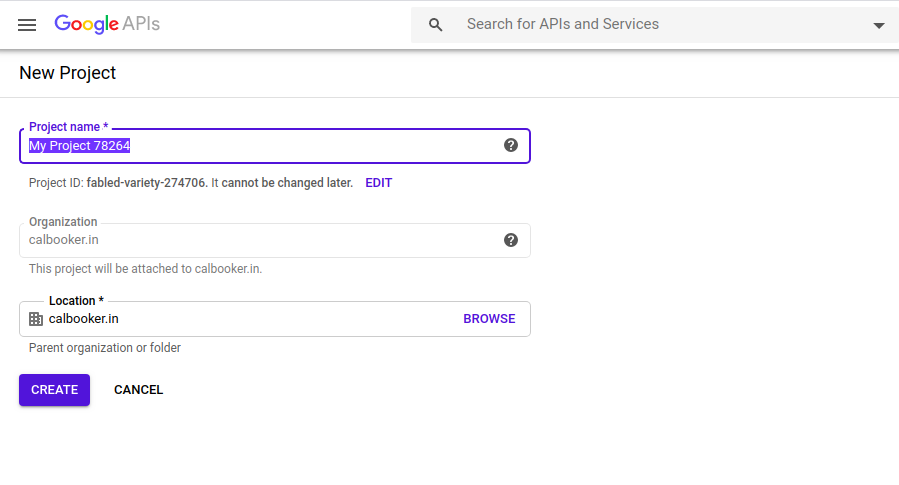

### Congratulations Project is created!!! Dashboard of console will look like following

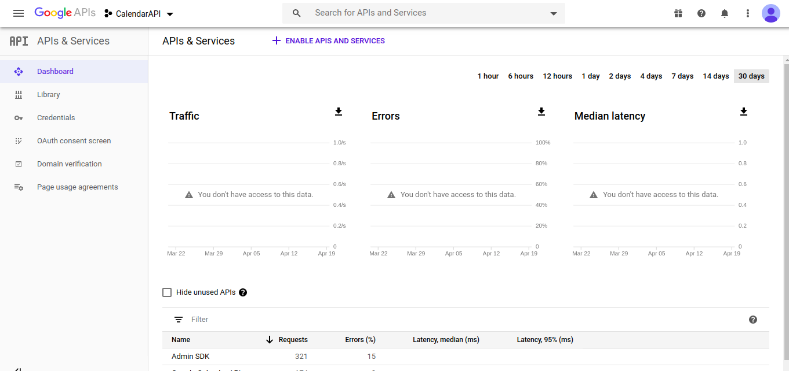

### Step 4: Enable the APIs which are required for this application

* Calendar API (For CRUD Operations on indiviuals calendar)
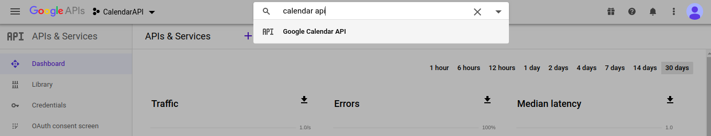
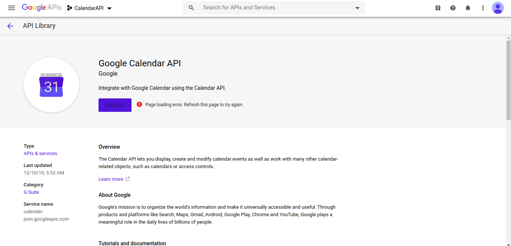 Click on Enable button

* ADMIN SDK (For accessing resources, users and groups details) (read-only)

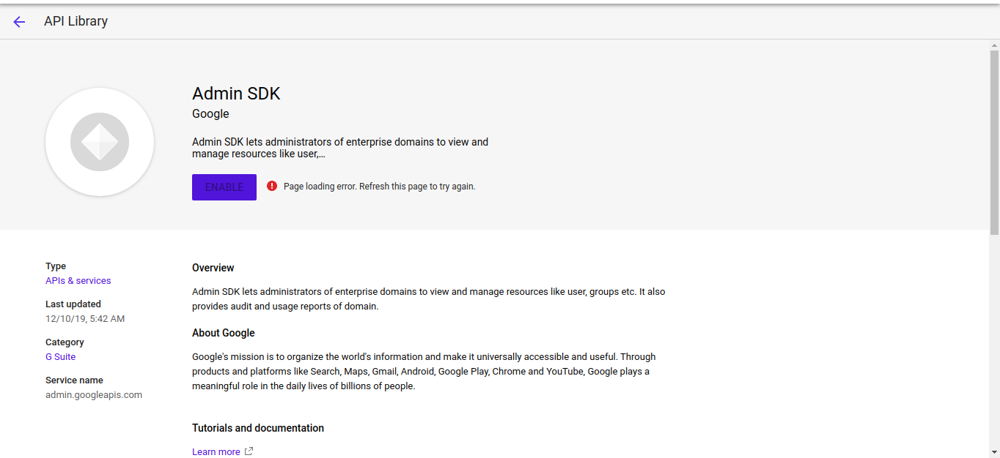 Click on Enable button

### Step 5: Create OAuth Client to access this application/project using REST APIs

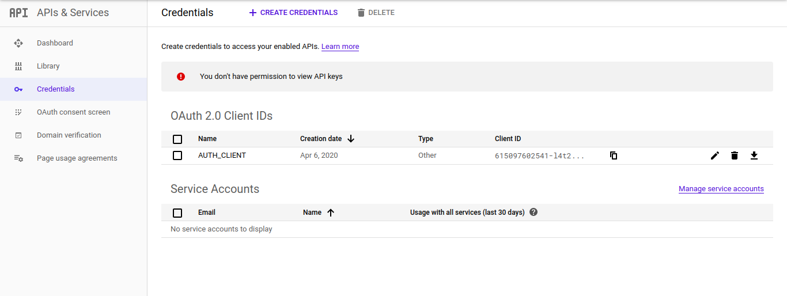 Click on Create crendentials
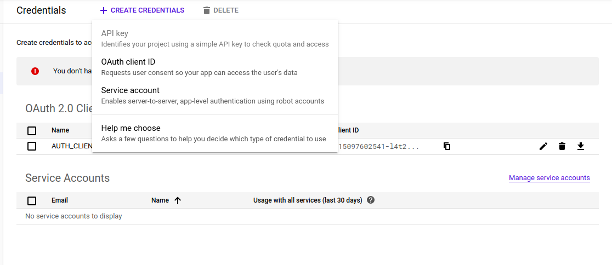 Click on OAuthClient ID
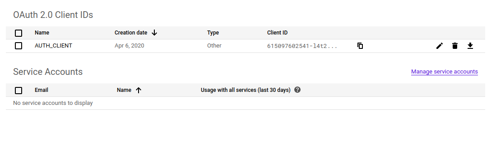 OAuth client ID is created

### Step 6: Log on to Google Admin Console To create users, groups and shared resources such as meeting rooms, cabs, play rooms, etc.

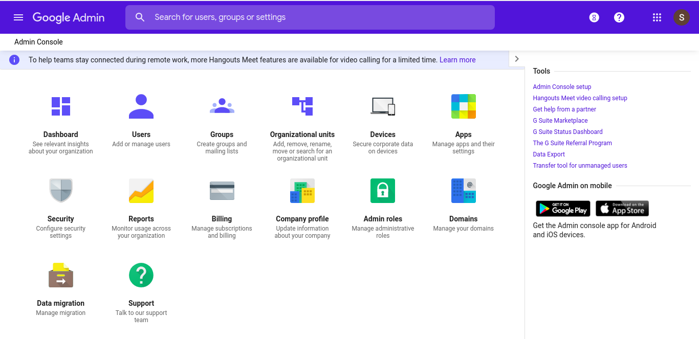 Google Admin Console Dashboard

### Step 7: Create some users and One admin user to access the users details and group details on your behalf and assign a custom role to this user.

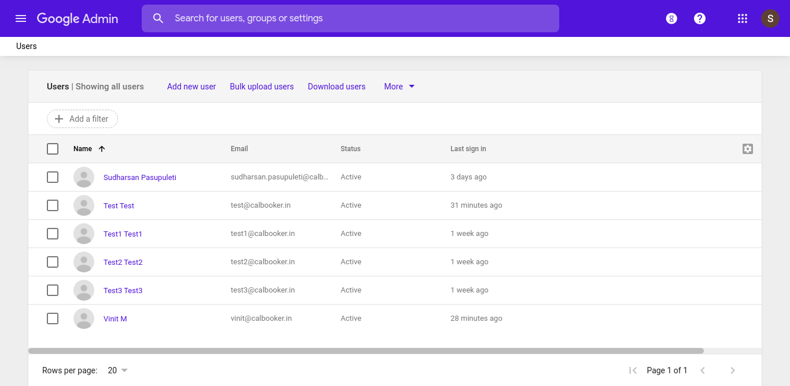 Users console
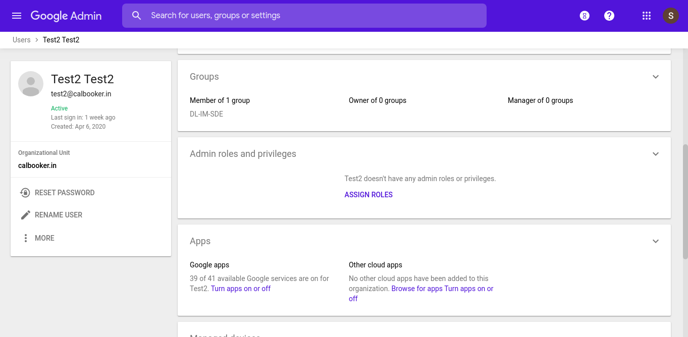 Create a new user who is going to use this application
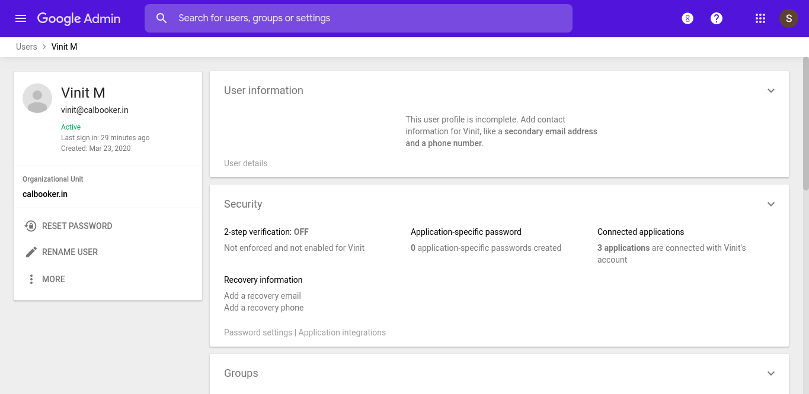 Create a new user who will act as admin. Create the normal user only will make this user admin by assigning Admin Role.

### Step 8: Create a custom Admin Role which will access users details and groups details

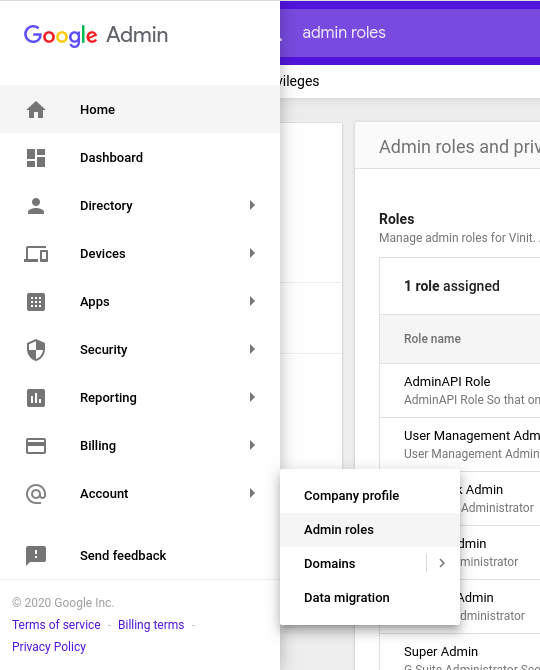 navigate to Admin Role console Menu->Account->Admin Roles
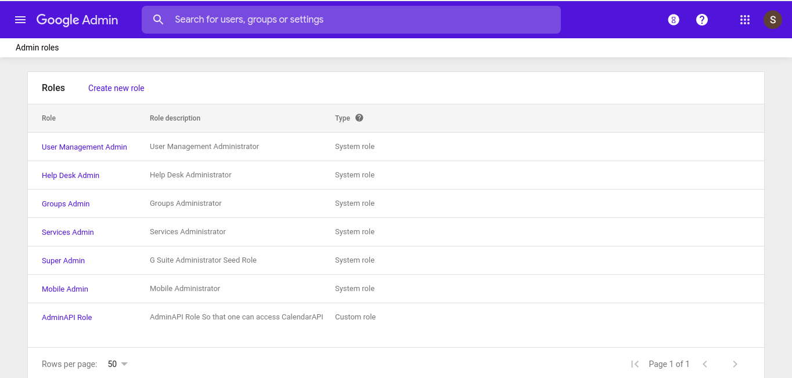 click on create new role
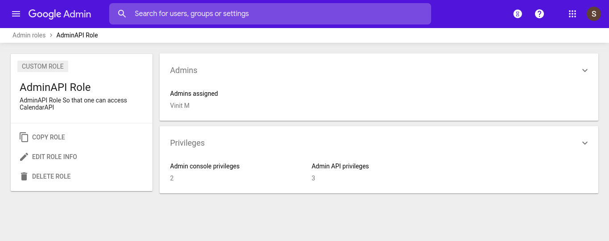 new role created now select privileges 
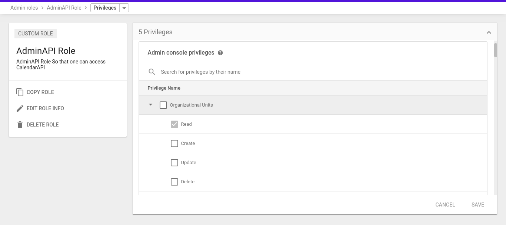 select read-only for users, groups and resources

### Step 9: Assign this newly created role to the admin user that we have created above 

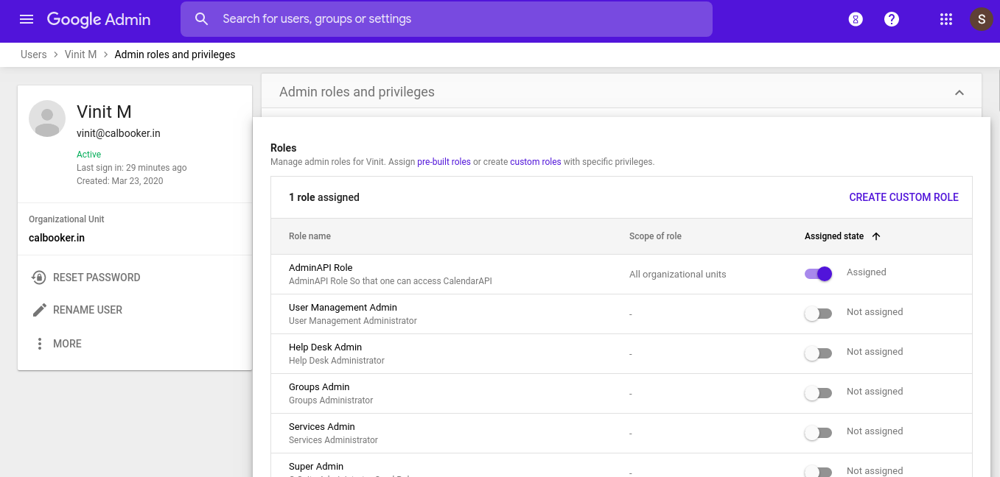 Find the role and make it enable 

## Congratulations we are all set for to Access Calendar remotely without Calendar Application
